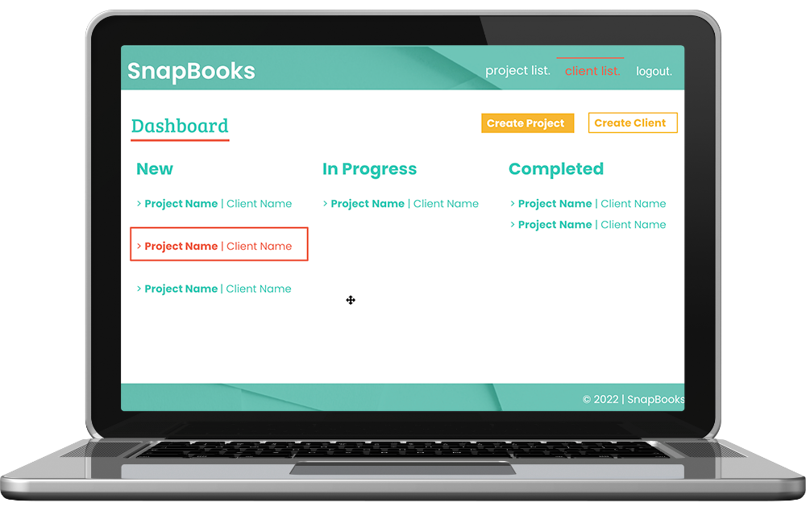

# SnapBooks
Easily organize your clients and their projects then track the estimates for those projects from start to finish in a snap!

## Description
Create, track, and maintain clients, their projects, and associated estimates.

## Motivation
Real life experience hearing the need for freelancers to be able to easily perform a key portion of their work.

## User Story
```
AS A freelancer
I WANT to be able to easily track and maintain my clients and their projects
SO THAT I can quickly provide new estimates or status updates on existing projects
```

## Technologies Used
- Express.js
- Handlebars.js
- PDFKit
- Sequelize
- MySQL2
- bcrypt
- dotenv
- express-sessions

## Contributors

- [@ashleyviola](https://github.com/ashleyviola): Views, assets (JS, CSS, imagery), repo host, Heroku, publisher, project organizer
- [@phopps](https://github.com/phopps): Controllers, initial research for outside tech
- [@LSabin23](https://github.com/LSabin23): Models, PDFKit, presentation

## Screenshots
Homepage:


Client creation:


PDF generation:


## Future Development

- Ability to Edit/Delete Clients & Projects
- Modularize PDF creation and build additional PDF routes
    - Plenty of opportunities to expand on PDF creation
- Add Project Status-based Dashboard Overview
  - Kanban-style for Clients and Projects
  - Statuses include New, In Progress, and Completed
  - Fits in with an Agile workflow


## Links
Heroku live deployment:
[SnapBooks on Heroku](https://pacific-chamber-43942.herokuapp.com/)

Code repository:
[SnapBooks on GitHub](https://github.com/ashleyviola/snapbooks)
